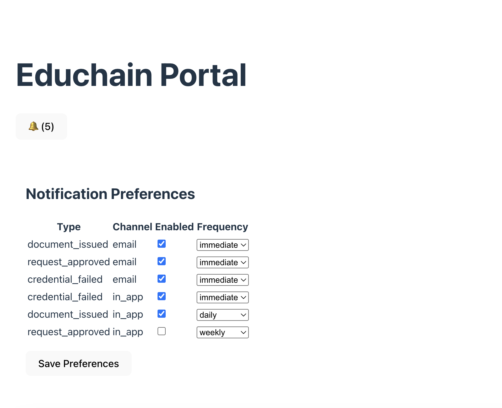
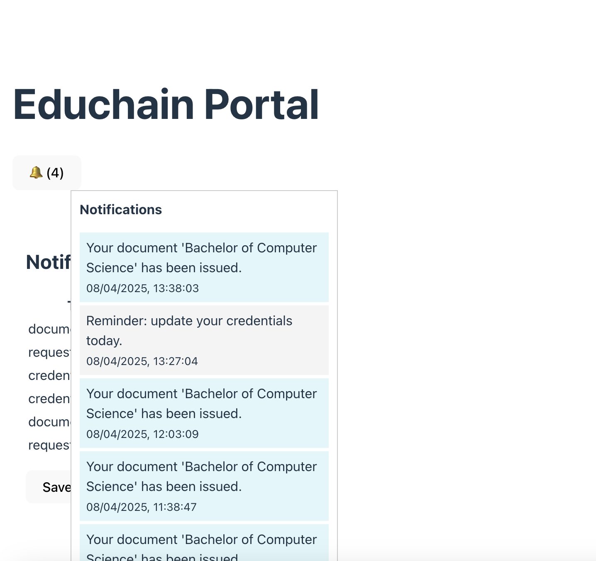
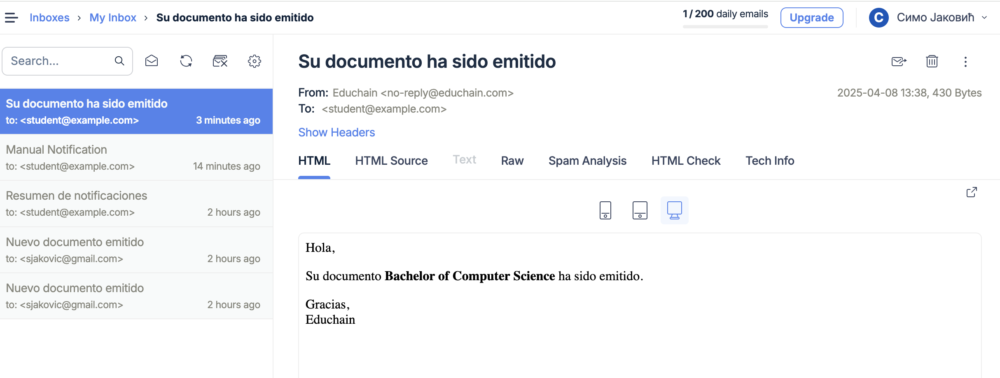

# 📘 Educhain Notification System

## 🏫 Project Overview

This project implements a centralized **Notification System** for Educhain’s applications:

- **Publisher** – for issuing and managing credentials
- **Academic Passport** – for students to access credentials
- **Verification Portal** – for employers and third parties

The system provides:

- 🔔 Real-time in-app notifications
- ✉️ Email notifications (immediate + digest)
- 🎛️ Notification preferences (type, channel, frequency)
- 🌍 Localization (English & Spanish)
- 🧑‍💼 Admin-triggered manual notifications

---

## ⚙️ Technologies Used

- **Symfony 6** (PHP 8.2+)
- **PostgreSQL 16**
- **Doctrine ORM**
- **Symfony Mailer** (Mailtrap for dev)
- **React + Vite**
- **Twig** for email templates
- **Symfony Translation** for localization

---

## 🚀 How to Run

### Backend (Symfony)

```bash
composer install
cp .env .env.local
# Update DB credentials in .env.local
php bin/console doctrine:database:create
php bin/console doctrine:migrations:migrate
symfony serve
```

Mailer: configure MAILER_DSN in .env.local using Mailtrap

⸻

Frontend (React + Vite)

cd assets/frontend
npm install
npm run dev

Visit: http://localhost:3000

Vite is configured to proxy /api to Symfony on port 8000

⸻

🔧 Test Features

1. Trigger a Test Notification

Go to:
http://localhost:8000/test/dispatch
•	Creates an in-app notification
•	Sends localized email (EN or ES)

⸻

2. View Notifications (In-App)

React UI will show:
•	🔔 Notification bell with unread count
•	Click to open dropdown
•	Click to mark as read (API call)

⸻

3. Preferences Management UI

Visit React app and manage:
•	Types of notifications
•	Channel (in_app, email)
•	Frequency (immediate, daily, weekly)

Preferences are synced via GET /api/preferences and PUT /api/preferences.

⸻

4. Digest Email Delivery

php bin/console app:send-digest-notifications

	•	Sends daily/weekly grouped notifications
	•	Localized subject and template
	•	Uses Twig + Symfony Translator

⸻

5. Admin: Manual Notifications

Endpoint: POST /api/notifications/manual

{
"userId": 1,
"type": "admin_message",
"message": "Reminder: update your credentials today.",
"digest": false,
"sendEmail": true
}

	•	Creates notification manually
	•	Sends email if sendEmail = true

⸻

🌐 Localization
•	Email templates: emails/notifications/*.en.html.twig, *.es.html.twig
•	Subjects: translations/messages.en.yaml, messages.es.yaml
•	Translation via TranslatorInterface

⸻

✅ Acceptance Criteria Coverage

Requirement	Implemented
In-app notifications	✅
Email notifications	✅
Digest delivery (daily/weekly)	✅
Preferences (type/channel/frequency)	✅
Multi-language (EN/ES) support	✅
Manual admin notifications	✅
Real-time (optional WebSocket)	❌ Not required


⸻

📸 Screenshots






⸻

📁 Structure Highlights

<pre>
src/
├── Event/
│   └── DocumentIssuedEvent.php
├── EventListener/
│   └── DocumentIssuedListener.php
├── Controller/
│   ├── NotificationController.php
│   ├── NotificationPreferenceController.php
│   └── AdminNotificationController.php
├── Entity/
│   ├── Notification.php
│   └── NotificationPreference.php

assets/frontend/
└── src/components/
    ├── NotificationBell.jsx
    └── NotificationPreferences.jsx
</pre>

🙋 Author

Simo Jakovic
GitHub: github.com/simojakovic
Email: s.jakovic@gmail.com

---
